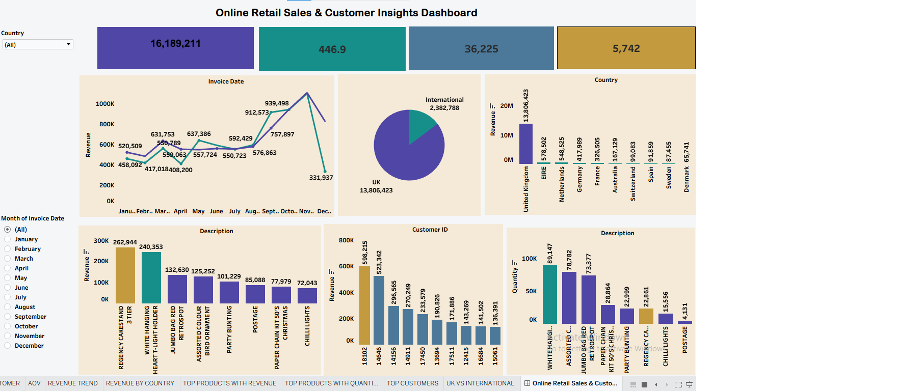

# Online Retail Sales & Customer Insights Dashboard

## Overview
This project analyzes transactional sales data from an online retail business to uncover insights into revenue performance, customer purchasing behavior, product performance, and geographic sales distribution.

## Dataset
Online retail transactions recorded between 2010 and 2011, with fields:
| Column | Description |
|---|---|
| Invoice | Unique invoice number |
| StockCode | Product ID code |
| Description | Product description |
| Quantity | Units purchased |
| InvoiceDate | Date/time of transaction |
| Price | Unit price |
| Customer_ID | Unique customer identifier |
| Country | Customer location |

## Tools
- **Python (Pandas, NumPy)** — data loading, EDA, cleaning, and feature engineering
- **SQL Server** — analytical querying
- **Tableau** — dashboard development
- **Microsoft Excel** — supporting analysis
- **Gamma** — presentation deck creation

## Steps
1. Loaded the raw transaction data in Python and explored its structure
2. Performed exploratory data analysis (EDA) on revenue, orders, products, and customers
3. Cleaned the data:
   - Removed records with missing Customer IDs
   - Converted InvoiceDate to DateTime format
   - Converted Customer_ID from decimal to string format
   - Resolved other data quality issues
4. Engineered new features: Revenue (Quantity × Price), OrderType (Retail/Wholesale), IsCancellation
5. Loaded the cleaned data into SQL Server and ran queries to answer 7 business questions
6. Built an interactive Tableau dashboard with KPI cards and filters
7. Summarized insights into a written report
8. Created a summary presentation using Gamma

## Dashboard
Tableau dashboard including:
- **KPIs:** Total Revenue, Total Orders, Total Customers, Average Order Value (AOV)
- **Visuals:** Revenue Trend Analysis, Revenue by Country, Top 10 Products by Revenue & Quantity Sold, Top 10 Customers by Revenue, UK vs. International Revenue Comparison

- 
*Figure 1: Online Retail Sales & Customer Insights Dashboard — revenue trend, top products, and country performance*

## Results
- Revenue showed noticeable seasonal fluctuations across months
- Customer repeat-purchase rate: **72.39%**
- Top 20% of customers generated **77.26%** of total revenue
- The United Kingdom contributed the largest share of revenue
- A small set of products drove a significant proportion of total revenue

## How to Run
1. Load the raw transaction CSV in Python and run the cleaning/feature-engineering script
2. Load the cleaned data into SQL Server and run the provided analysis queries
3. Connect Tableau to the SQL Server output and open the dashboard workbook (`.twbx`)
4. Refer to the PDF report and Gamma slides for full findings and recommendations

## Data Source & Availability
The analysis handles over 1 million rows of real-world e-commerce data divided across two major operational tracking sheets. Because these raw source files exceed 80MB each, they are omitted from this repository to optimize loading and directory performance:

*   🗃️ **`raw_retail_transactions.csv`** (Originally `online_retail_II.csv` | ~92.6 MB)
*   💰 **`raw_sales_logs.csv`** (Originally `SalesTransactions.csv` | ~84.5 MB)

You can view details and download both official parent datasets directly from these open-source portals:
* 🏛️ **Primary Host:** [UCI Machine Learning Repository - Online Retail II Dataset](https://archive.ics.uci.edu/dataset/502/online+retail+ii "Online Retail II")
* 🦅 **Mirror Host:** [Kaggle - UCI Online Retail II Repository](https://www.kaggle.com/datasets/mashlyn/online-retail-ii-uci "Online Retail II UCI")
